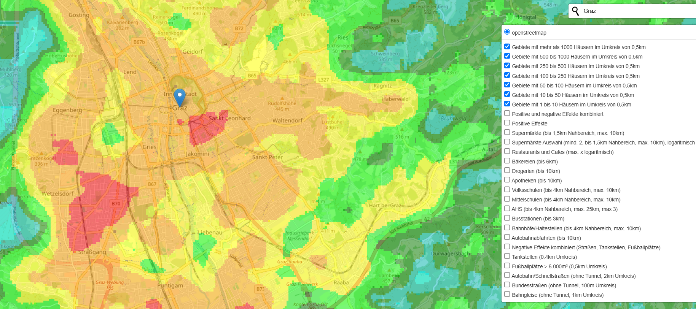
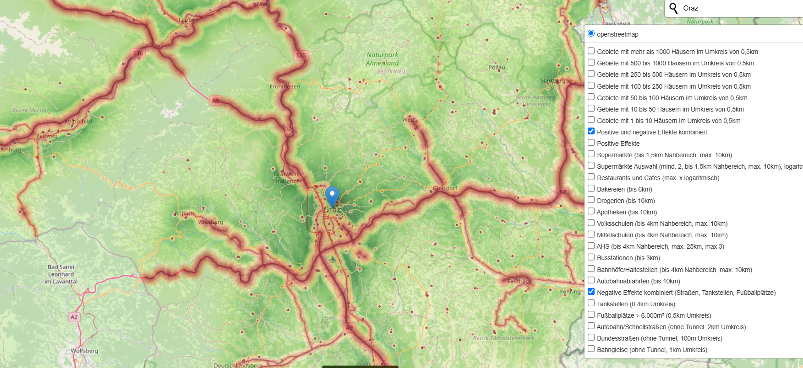
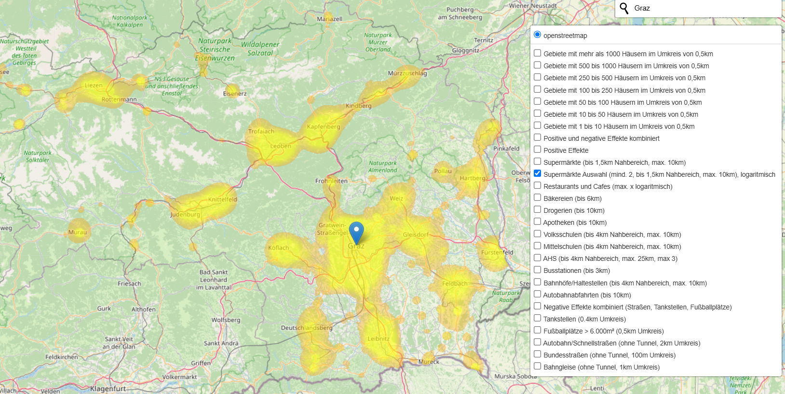

# silent-streets
Creates map images of regions for assessing the quality of infrastructure as well as the noise pollution.

## Introduction

One time we moved into a new apartment and underestimated the negative impact of a gasstation and a football field nearby. 
Before we moved the next time I tried to use open data for excluding potential new homes with similar bad surroundings.
Besides aquiring the data the project also helped me structure and weight the different features that could have a positive or negative impact on the quality of life.

This project is about creating a map of a region with different layers of information. How the features are weighted is subjective and can be adjusted to the needs of the user in the provided jupyter notebooks.

Here is theblazesz version with regional data of Austria.
The map and all feature layers can be explored in the created HTML file.

## Use of Map

The output of the calculation is a single HTML file, with multiple layers of information.
Every Layer visualizes one or more features.

`Available layers are:`

- Density of houses in the region (multiple layers of information)
- Availability of different shools
- Availability of supermarkets, as well as the availability of different supermarkets in the region
- Public transport stations (Bus and Train)
- Motorway entrances and exits
- Restaurants and Cafes
- Pharmacies
- Bakeries
- Gasstations (negativ because of noise)
- Motorways and train tracks (negativ because of noise)
- Football fields (negativ because of noise)
- Combined layers of positive and negative features

Go to the Release section of this repository and download a calulated map of features of Styria, Austria.

### Example 1: Density of Houses


### Example 2: Map of positive and negative features


### Example 3: Availability of different Supermarkets



## Installation

Use python 3.11 or higher

install the required packages with pip

```sh
pip install -r requirements.txt
```

Go to the ```notebooks``` folder.

### Notebook 01_download_and_parse.ipynb

This notebook downloads the data from OpenStreetMap, Wikipedia and other sources.

The main source is OSM.

Data is cached in the configured ```data``` folder.

For OSM the Overpass API is used to download POIs and stores them in CSV files.

Fr some special cases the reverse lookup function for finding coordinates of an address is used.

The coordinates are in the WGS84 format (Latitude, Longitude), for the visualization in the HTML file the coordinates are converted to the Web Mercator format (EPSG:3857).

The region covered is by default Styria Austria, but can be changed to any region that OSM supports.

### Notebook 02_create_maps.ipynb

This notebook calculates the features and create images for the layers used in the HTML file.

The general idea is that one can specify how car a point has an impact on the map, e.g. a Motorway could be heard from a distance of 2km, but with decreasing volume.
The combination of different features in the positive and negative feature layers is weighted. Because the needs of people are subjective, the weights are subjective as well and must be adjusted to the needs of the user.

Features are stored in the ````data/cache``` folder and images of layers are stored in the ```data/maps``` folder.
Images are stored in PNG and WebP format, the WebP format is used (by default) in the HTML file because of the higher compression and the support of non-lossless compression.

Large datasets, e.g. houses, are split in smaller parts by covering the region with a grid and download the data for each grid cell.

The main class Rastarize helps with the organization and conversion of the data.

Rastaruze also supports the configuration of cell sizes, defining how detailed thebmaps are calculated, currently the cells are 50x50 meters.
More and smaller cells also means longer computation.
The houses dataset already has a much faster algorithm for applying the kernel function of the feature. Bynusing that on all featur maps, smaller cells and larger maps shoudn't be a problem.
If this is not enougth GPU acceleration like Nvidia rapids should give a large performance boost.

### Notebook 03_create_html.ipynb

This notebook creates the HTML file with the layers of the map. The notebook uses the folium library.


## Used Data/Licences

Shools in Styria/Austria Datasource: CC-BY-4.0: Land Steiermark - data.steiermark.gv.at
